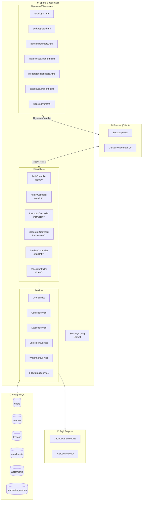
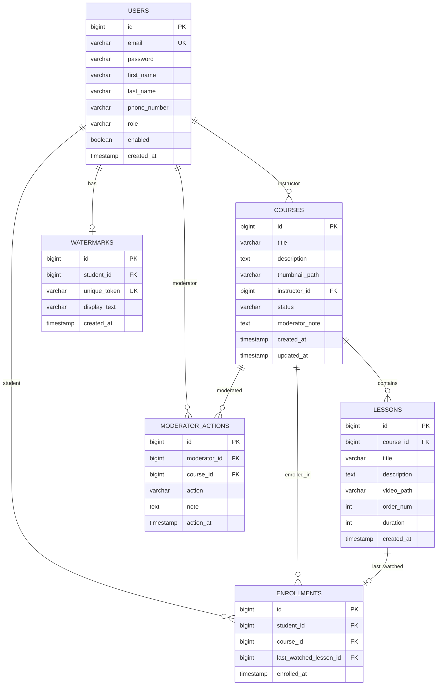
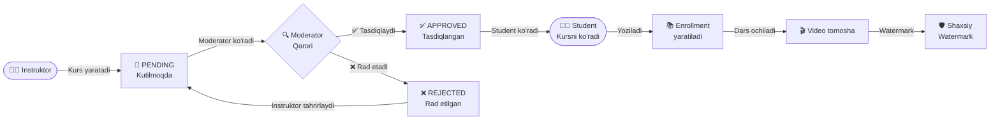
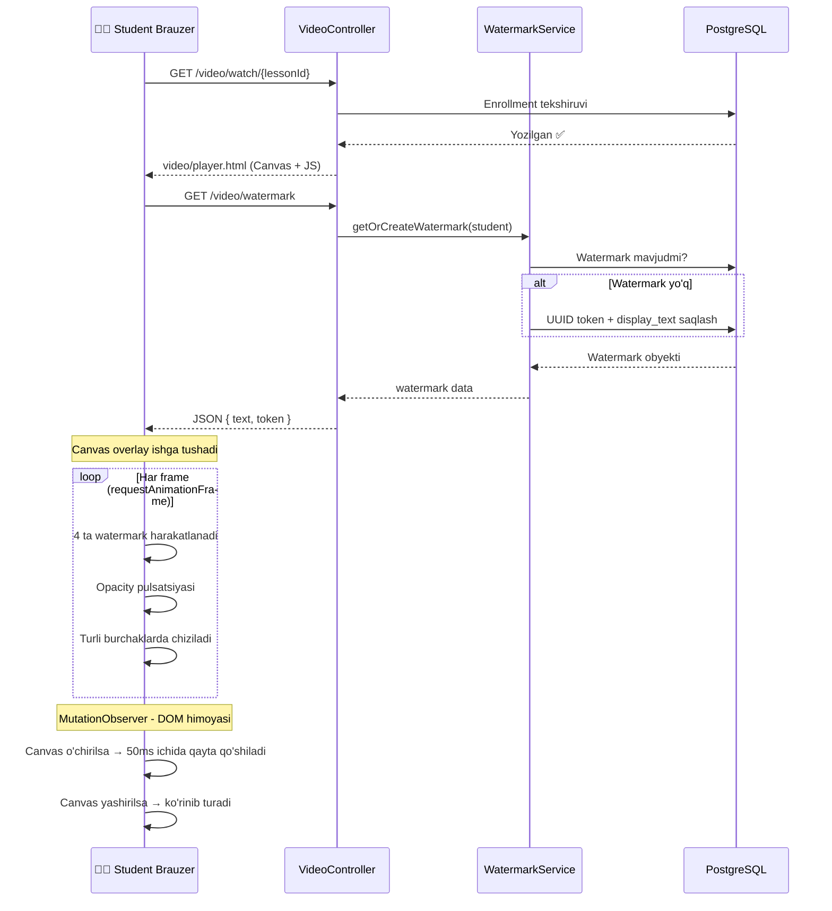

<div align="center">

# 🎓 Eilmuz — O'quv Platformasi

**Spring Boot · Thymeleaf · PostgreSQL · Spring Security**

[](https://openjdk.org/projects/jdk/17/)
[](https://spring.io/projects/spring-boot)
[](https://www.postgresql.org/)
[](https://www.thymeleaf.org/)
[](https://getbootstrap.com/)
[](LICENSE)

> **Eilmuz** — instruktorlar kurs joylaydi, moderatorlar tasdiqlaydi, studentlar ko'radi va o'rganadi.  
> Har bir student uchun maxsus **watermark** bilan video himoyalangan.

</div>

---

## 📋 Mundarija

- [Loyiha haqida](#-loyiha-haqida)
- [Imkoniyatlar](#-imkoniyatlar)
- [Rollar va huquqlar](#-rollar-va-huquqlar)
- [Arxitektura](#-arxitektura)
- [Ma'lumotlar bazasi sxemasi](#-malumotlar-bazasi-sxemasi)
- [Kurs hayot sikli](#-kurs-hayot-sikli)
- [Video Watermark tizimi](#-video-watermark-tizimi)
- [Sahifalar ko'rinishi](#-sahifalar-korinishi)
- [URL marshrutlar jadvali](#-url-marshrutlar-jadvali)
- [Texnologiyalar](#-texnologiyalar)
- [Loyihani ishga tushirish](#-loyihani-ishga-tushirish)
- [Muhit o'zgaruvchilari](#-muhit-ozgaruvchilari)
- [Fayl tuzilmasi](#-fayl-tuzilmasi)

---

## 📖 Loyiha haqida

**Eilmuz** — Figma dizayni asosida yaratilgan to'liq funksional onlayn ta'lim platformasi.

| Xususiyat | Tavsif |
|-----------|--------|
| 🔐 Autentifikatsiya | Email + parol orqali ro'yxatdan o'tish va kirish |
| 🎥 Video darslar | Instruktor video yuklaydi, student tomosha qiladi |
| 🛡️ Watermark | Har bir student uchun unikal, harakatlanuvchi watermark |
| ✅ Moderatsiya | Kurslar moderator tomonidan tasdiqlanadi |
| 📊 Admin panel | Platforma bo'yicha to'liq statistika |

---

## ✨ Imkoniyatlar

### 👨‍🎓 Student
- Email va telefon raqami bilan ro'yxatdan o'tish
- Tasdiqlangan kurslarni ko'rish va ularga yozilish
- Video darslarni tomosha qilish (faqat yozilgan kurslarda)
- Shaxsiy dashboard: yozilgan kurslar va mavjud kurslar

### 👨‍🏫 Instruktor
- Kurs yaratish (sarlavha, tavsif, muqova rasm)
- Kursga video darslar qo'shish (500 MB gacha)
- O'z kurslari holatini kuzatish (Kutilmoqda / Tasdiqlangan / Rad etilgan)

### 🔍 Moderator
- Kutilayotgan kurslar ro'yxatini ko'rish
- Kursni tasdiqlash yoki rad etish (izoh bilan)
- Moderatsiya tarixi

### 🏛️ Administrator
- Umumiy statistika (instruktorlar, studentlar, kurslar soni)
- Har bir instruktorda nechta kurs borligi
- Har bir student qaysi kurslarda o'qiyotgani
- Moderatorlar nima qilganini ko'rish

---

## 👥 Rollar va huquqlar

```
┌─────────────────────────────────────────────────────────────────┐
│                         EILMUZ PLATFORM                         │
├──────────────┬──────────────────────────────────────────────────┤
│    ROL       │              HUQUQLAR                            │
├──────────────┼──────────────────────────────────────────────────┤
│  STUDENT     │  • Kurs ko'rish va yozilish                      │
│              │  • Video tomosha qilish (watermark bilan)        │
│              │  • Shaxsiy dashboard                             │
├──────────────┼──────────────────────────────────────────────────┤
│  INSTRUCTOR  │  • Kurs yaratish va tahrirlash                   │
│              │  • Video dars yuklash                            │
│              │  • Kurs holati kuzatish                          │
├──────────────┼──────────────────────────────────────────────────┤
│  MODERATOR   │  • Kurslarni tasdiqlash / rad etish              │
│              │  • Moderatsiya tarixi                            │
├──────────────┼──────────────────────────────────────────────────┤
│  ADMIN       │  • Barcha ma'lumotlarga kirish                   │
│              │  • To'liq statistika paneli                      │
│              │  • Barcha foydalanuvchilar ro'yxati              │
└──────────────┴──────────────────────────────────────────────────┘
```

---

## 🏗️ Arxitektura



---

## 🗄️ Ma'lumotlar bazasi sxemasi



---

## 🔄 Kurs hayot sikli



---

## 🛡️ Video Watermark tizimi

Har bir student videoni tomosha qilganda uning ismini ko'rsatuvchi **unikal, harakatlanuvchi watermark** paydo bo'ladi. Bu watermarkni o'chirib bo'lmaydi.



### Watermark xavfsizlik qatlamlari

| Himoya usuli | Tavsif |
|---|---|
| `pointer-events: none` | Canvas ustida sichqoncha bilan hech narsa qilib bo'lmaydi |
| `z-index: 9999` | Canvas har doim eng ustda turadi |
| `MutationObserver` | Canvas DOM dan o'chirilsa, 50ms ichida qayta qo'shiladi |
| `setInterval` (1s) | Har 1 soniyada canvas yashirilganligini tekshiradi |
| Server tekshiruvi | `/video/stream` da yozilish tekshiriladi, aks holda `403` |
| `controlsList="nodownload"` | Brauzer standart yuklab olish tugmasini yashiradi |
| `oncontextmenu="return false"` | Video ustida o'ng tugma menyu chiqmaydi |

---

## 🖥️ Sahifalar ko'rinishi

### 🔑 Login sahifasi — `/auth/login`

```
┌─────────────────────────────────────────┐
│          🎓 EILMUZ                      │
│                                         │
│  ┌─────────────────────────────────┐    │
│  │            Kirish               │    │
│  │                                 │    │
│  │  Email: [____________________]  │    │
│  │  Parol: [____________________]  │    │
│  │                                 │    │
│  │  [        Kirish        ]       │    │
│  │                                 │    │
│  │  Hisobingiz yo'qmi?             │    │
│  │  → Ro'yxatdan o'ting            │    │
│  └─────────────────────────────────┘    │
└─────────────────────────────────────────┘
```

### 📝 Ro'yxatdan o'tish — `/auth/register`

```
┌─────────────────────────────────────────┐
│  ┌─────────────────────────────────┐    │
│  │     Yangi hisob yaratish        │    │
│  │                                 │    │
│  │  Ism:      [__________]         │    │
│  │  Familiya: [__________]         │    │
│  │  Email:    [________________]   │    │
│  │  Telefon:  [+998 __ ___ __ __] │    │
│  │  Parol:    [________________]   │    │
│  │  Tasdiqlash:[_______________]   │    │
│  │                                 │    │
│  │  Rol: ⦿ Student  ○ Instruktor  │    │
│  │                                 │    │
│  │  [   Ro'yxatdan o'tish   ]      │    │
│  └─────────────────────────────────┘    │
└─────────────────────────────────────────┘
```

### 📊 Admin Dashboard — `/admin/dashboard`

```
┌──────────────────────────────────────────────────────────────────┐
│  🎓 EILMUZ  [Admin Panel]                        [Chiqish 🚪]   │
├──────────────────────────────────────────────────────────────────┤
│                                                                  │
│  ┌──────────┐  ┌──────────┐  ┌──────────┐  ┌──────────┐        │
│  │Instruktor│  │ Student  │  │Tasdiqlngn│  │ Kutilmqda│        │
│  │    12    │  │   248    │  │   45     │  │    7     │        │
│  └──────────┘  └──────────┘  └──────────┘  └──────────┘        │
│                                                                  │
│  Instruktorlar va kurslar     Studentlar va yozilishlar          │
│  ┌──────────────────────┐    ┌──────────────────────┐           │
│  │ Ism   │ Email  │ #   │    │ Ism    │ Email  │ #  │           │
│  │ Ali   │ ali@.. │ 5   │    │ Zafar  │ zaf@.. │ 8  │           │
│  │ Barno │ bar@.. │ 3   │    │ Dilnoza│ dil@.. │ 5  │           │
│  └──────────────────────┘    └──────────────────────┘           │
│                                                                  │
│  So'nggi moderator amallar                                       │
│  ┌──────────────────────────────────────────────────────────┐   │
│  │ Moderator │ Kurs            │ Amal        │ Vaqt         │   │
│  │ Kamola    │ Python darslari │ ✅ APPROVED │ 24 Feb 10:30 │   │
│  │ Jasur     │ Web dizayn      │ ❌ REJECTED │ 23 Feb 15:20 │   │
│  └──────────────────────────────────────────────────────────┘   │
└──────────────────────────────────────────────────────────────────┘
```

### 🎬 Video Player — `/video/watch/{lessonId}`

```
┌──────────────────────────────────────────────────────────────────┐
│  🎓 EILMUZ                           [← Kursga qaytish]         │
├──────────────────────────────────────────────────────────────────┤
│                                                                  │
│  ┌────────────────────────────────────────────────────────┐     │
│  │                                                        │     │
│  │  Ali S. ali***@gmail.com  ←── harakatlanuvchi watermark│     │
│  │                                                        │     │
│  │              [ ▶  VIDEO KONTENT  ]                     │     │
│  │                                                        │     │
│  │                        Ali S. ali***@gmail.com         │     │
│  │                                                        │     │
│  │  Ali S. ali***@gmail.com                               │     │
│  │  ▶  ━━━━━━━━━━━━━━●━━━━━━━━  🔊  [⛶]                 │     │
│  └────────────────────────────────────────────────────────┘     │
│                          ↑                                       │
│              Canvas overlay — o'chirib bo'lmaydi                 │
│                                                                  │
│  📚 1-dars: Python asoslari                                      │
│  Bu darsda Python dasturlash tili bilan tanishamiz...           │
└──────────────────────────────────────────────────────────────────┘
```

### 🎓 Instruktor Dashboard — `/instructor/dashboard`

```
┌──────────────────────────────────────────────────────────────────┐
│  🎓 EILMUZ  [Instruktor Panel]                 [+ Yangi kurs]   │
├──────────────────────────────────────────────────────────────────┤
│  📚 Mening kurslarim                                             │
│                                                                  │
│  ┌────────────────┐  ┌────────────────┐  ┌────────────────┐    │
│  │ 🖼️ [thumbnail] │  │ 🖼️ [thumbnail] │  │ 🖼️ [thumbnail] │    │
│  │ Python 101     │  │ Web Dizayn     │  │ SQL Asoslari   │    │
│  │ ✅ APPROVED    │  │ ⏳ PENDING     │  │ ❌ REJECTED    │    │
│  │ 5 ta dars      │  │ 3 ta dars      │  │ 2 ta dars      │    │
│  │ [+Dars qo'sh]  │  │ [+Dars qo'sh]  │  │ [+Dars qo'sh]  │    │
│  └────────────────┘  └────────────────┘  └────────────────┘    │
└──────────────────────────────────────────────────────────────────┘
```

### ✅ Moderator Dashboard — `/moderator/dashboard`

```
┌──────────────────────────────────────────────────────────────────┐
│  🎓 EILMUZ  [Moderator Panel]                                    │
├──────────────────────────────────────────────────────────────────┤
│  📋 Kutilayotgan kurslar                                         │
│                                                                  │
│  ┌──────────────────────────────────────────────────────────┐   │
│  │ Kurs nomi       │ Instruktor  │ Sana     │ Amal          │   │
│  │─────────────────┼─────────────┼──────────┼───────────────│   │
│  │ Python darslari │ Ali Karimov │ 24.02.26 │ [✅][❌+izoh] │   │
│  │ React kursi     │ Sarvar U.   │ 23.02.26 │ [✅][❌+izoh] │   │
│  │ Data Science    │ Nilufar T.  │ 22.02.26 │ [✅][❌+izoh] │   │
│  └──────────────────────────────────────────────────────────┘   │
└──────────────────────────────────────────────────────────────────┘
```

### 📚 Student — Kurslar ro'yxati — `/student/courses`

```
┌──────────────────────────────────────────────────────────────────┐
│  🎓 EILMUZ  [Student Panel]                                      │
├──────────────────────────────────────────────────────────────────┤
│  🔍 Barcha kurslar                                               │
│                                                                  │
│  ┌────────────────┐  ┌────────────────┐  ┌────────────────┐    │
│  │ 🖼️ [thumbnail] │  │ 🖼️ [thumbnail] │  │ 🖼️ [thumbnail] │    │
│  │ Python 101     │  │ Web Dizayn     │  │ SQL Asoslari   │    │
│  │ Ali Karimov    │  │ Barno Yusupova │  │ Jasur Toshev   │    │
│  │                │  │                │  │                │    │
│  │ [✅ Yozilgan]  │  │ [+ Yozilish]   │  │ [+ Yozilish]   │    │
│  └────────────────┘  └────────────────┘  └────────────────┘    │
└──────────────────────────────────────────────────────────────────┘
```

---

## 🗺️ URL marshrutlar jadvali

### Umumiy (hamma uchun)

| URL | Metod | Tavsif |
|-----|-------|--------|
| `/auth/login` | GET, POST | Kirish sahifasi |
| `/auth/register` | GET, POST | Ro'yxatdan o'tish |
| `/auth/logout` | POST | Chiqish |
| `/dashboard` | GET | Rol bo'yicha yo'naltirish |

### Student (`/student/**`)

| URL | Metod | Tavsif |
|-----|-------|--------|
| `/student/dashboard` | GET | Student bosh sahifasi |
| `/student/courses` | GET | Barcha tasdiqlangan kurslar |
| `/student/courses/{id}` | GET | Kurs tafsiloti va darslar |
| `/student/courses/{id}/enroll` | POST | Kursga yozilish |

### Video (`/video/**`)

| URL | Metod | Tavsif |
|-----|-------|--------|
| `/video/watch/{lessonId}` | GET | Video tomosha sahifasi |
| `/video/stream/{lessonId}` | GET | Video fayl stream (Range so'rovlar) |
| `/video/watermark` | GET | Student watermark ma'lumotlari (JSON) |

### Instruktor (`/instructor/**`)

| URL | Metod | Tavsif |
|-----|-------|--------|
| `/instructor/dashboard` | GET | Instruktor bosh sahifasi |
| `/instructor/courses/new` | GET | Yangi kurs formasi |
| `/instructor/courses` | POST | Kurs yaratish |
| `/instructor/courses/{id}/lessons/new` | GET | Yangi dars formasi |
| `/instructor/courses/{id}/lessons` | POST | Dars va video yuklash |

### Moderator (`/moderator/**`)

| URL | Metod | Tavsif |
|-----|-------|--------|
| `/moderator/dashboard` | GET | Moderator bosh sahifasi |
| `/moderator/courses/{id}/approve` | POST | Kursni tasdiqlash |
| `/moderator/courses/{id}/reject` | POST | Kursni rad etish |

### Admin (`/admin/**`)

| URL | Metod | Tavsif |
|-----|-------|--------|
| `/admin/dashboard` | GET | To'liq statistika paneli |

---

## 🛠️ Texnologiyalar

| Qatlam | Texnologiya | Versiya |
|--------|-------------|---------|
| **Backend framework** | Spring Boot | 3.2.3 |
| **Xavfsizlik** | Spring Security | 6.x |
| **Ma'lumotlar bazasi** | PostgreSQL | 15+ |
| **ORM** | Spring Data JPA / Hibernate | 6.x |
| **Frontend template** | Thymeleaf | 3.x |
| **UI framework** | Bootstrap | 5.3 |
| **Ikonalar** | Bootstrap Icons | 1.10 |
| **Kod soddaligi** | Lombok | 1.18.x |
| **Ma'lumot tekshiruvi** | Bean Validation | 3.x |
| **Dasturlash tili** | Java | 17 |
| **Build tool** | Maven | 3.x |

---

## 🚀 Loyihani ishga tushirish

### Talablar

- ☕ **Java 17+** o'rnatilgan bo'lsin
- 🐘 **PostgreSQL 15+** o'rnatilgan bo'lsin
- 📦 **Maven 3.8+** o'rnatilgan bo'lsin

### 1. Ma'lumotlar bazasini tayyorlang

```sql
-- PostgreSQL ga ulanib, database yarating
CREATE DATABASE eilmuz;
CREATE USER eilmuz_user WITH PASSWORD 'yourpassword';
GRANT ALL PRIVILEGES ON DATABASE eilmuz TO eilmuz_user;
```

### 2. Kodni yuklab oling

```bash
git clone https://github.com/Shi200301/StartupEilmuz.git
cd StartupEilmuz
```

### 3. Muhit o'zgaruvchilarini sozlang

**Linux / macOS:**
```bash
export DB_URL=jdbc:postgresql://localhost:5432/eilmuz
export DB_USERNAME=eilmuz_user
export DB_PASSWORD=yourpassword
```

**Windows (CMD):**
```cmd
set DB_URL=jdbc:postgresql://localhost:5432/eilmuz
set DB_USERNAME=eilmuz_user
set DB_PASSWORD=yourpassword
```

### 4. Ilovani ishga tushiring

```bash
mvn spring-boot:run
```

Yoki JAR fayl sifatida:

```bash
mvn clean package -DskipTests
java -jar target/eilmuz-0.0.1-SNAPSHOT.jar
```

### 5. Brauzerda oching

```
http://localhost:8080
```

> 💡 Jadvallar avtomatik yaratiladi (`spring.jpa.hibernate.ddl-auto=update`)

---

## ⚙️ Muhit o'zgaruvchilari

| O'zgaruvchi | Majburiy | Default | Tavsif |
|-------------|----------|---------|--------|
| `DB_URL` | ✅ | `jdbc:postgresql://localhost:5432/eilmuz` | PostgreSQL URL |
| `DB_USERNAME` | ✅ | `postgres` | DB foydalanuvchi nomi |
| `DB_PASSWORD` | ✅ | `postgres` | DB paroli |
| `MAIL_USERNAME` | ❌ | *(bo'sh)* | Gmail manzil (email uchun) |
| `MAIL_PASSWORD` | ❌ | *(bo'sh)* | Gmail app password |

---

## 📁 Fayl tuzilmasi

```
StartupEilmuz/
├── pom.xml                                    # Maven konfiguratsiyasi
├── src/
│   └── main/
│       ├── java/uz/eilmuz/
│       │   ├── EilmuzApplication.java         # Asosiy kirish nuqtasi
│       │   │
│       │   ├── config/
│       │   │   ├── SecurityConfig.java        # Spring Security sozlamalari
│       │   │   └── WebConfig.java             # Resurs va upload sozlamalari
│       │   │
│       │   ├── model/                         # JPA Entity sinflar
│       │   │   ├── User.java
│       │   │   ├── Role.java                  # STUDENT, INSTRUCTOR, MODERATOR, ADMIN
│       │   │   ├── Course.java
│       │   │   ├── CourseStatus.java          # PENDING, APPROVED, REJECTED
│       │   │   ├── Lesson.java
│       │   │   ├── Enrollment.java
│       │   │   ├── Watermark.java
│       │   │   └── ModeratorAction.java
│       │   │
│       │   ├── repository/                    # Spring Data JPA
│       │   │   ├── UserRepository.java
│       │   │   ├── CourseRepository.java
│       │   │   ├── LessonRepository.java
│       │   │   ├── EnrollmentRepository.java
│       │   │   ├── WatermarkRepository.java
│       │   │   └── ModeratorActionRepository.java
│       │   │
│       │   ├── service/                       # Biznes mantiq
│       │   │   ├── UserService.java
│       │   │   ├── CourseService.java
│       │   │   ├── LessonService.java
│       │   │   ├── EnrollmentService.java
│       │   │   ├── WatermarkService.java
│       │   │   └── FileStorageService.java
│       │   │
│       │   ├── dto/                           # Ma'lumot uzatish obyektlari
│       │   │   ├── RegisterDto.java
│       │   │   ├── CourseDto.java
│       │   │   └── LessonDto.java
│       │   │
│       │   └── controller/                    # HTTP so'rovlari
│       │       ├── AuthController.java
│       │       ├── HomeController.java
│       │       ├── AdminController.java
│       │       ├── InstructorController.java
│       │       ├── ModeratorController.java
│       │       ├── StudentController.java
│       │       └── VideoController.java
│       │
│       └── resources/
│           ├── application.properties         # Asosiy konfiguratsiya
│           │
│           ├── static/
│           │   └── css/
│           │       └── style.css              # Maxsus uslublar
│           │
│           └── templates/                     # Thymeleaf HTML shablonlar
│               ├── layout/
│               │   └── main.html              # Asosiy layout
│               ├── auth/
│               │   ├── login.html
│               │   └── register.html
│               ├── admin/
│               │   └── dashboard.html
│               ├── instructor/
│               │   ├── dashboard.html
│               │   ├── course-form.html
│               │   └── lesson-form.html
│               ├── moderator/
│               │   └── dashboard.html
│               ├── student/
│               │   ├── dashboard.html
│               │   ├── courses.html
│               │   └── course-detail.html
│               └── video/
│                   └── player.html            # Video + Watermark Canvas
│
└── uploads/                                   # Yuklangan fayllar (avtomatik)
    ├── thumbnails/                            # Kurs muqova rasmlari
    └── videos/                               # Video fayllar
```

---

## 🔒 Xavfsizlik haqida

| Himoya | Tavsif |
|--------|--------|
| 🔑 BCrypt | Parollar xeshlangan, ochiq saqlanmaydi |
| 🛡️ CSRF | Barcha POST so'rovlarda CSRF token tekshiriladi |
| 🔐 Rol asosida | Har bir URL uchun alohida ruxsat tekshiruvi |
| 📁 Fayllar himoyasi | `/uploads/**` faqat autentifikatsiya qilingan foydalanuvchilarga |
| 📹 Video himoyasi | Student faqat yozilgan kurs videolarini ko'ra oladi (`403` aks holda) |
| 🖊️ Watermark | Har bir student uchun unikal, DOM manipulyatsiya orqali o'chirib bo'lmaydi |

---

## 📝 Litsenziya

Bu loyiha [MIT](LICENSE) litsenziyasi ostida tarqatiladi.

---

<div align="center">

**Eilmuz** — Bilim ulashish, ilm ortirish platformasi 🎓

*Spring Boot · Thymeleaf · PostgreSQL · Bootstrap 5*

</div>
